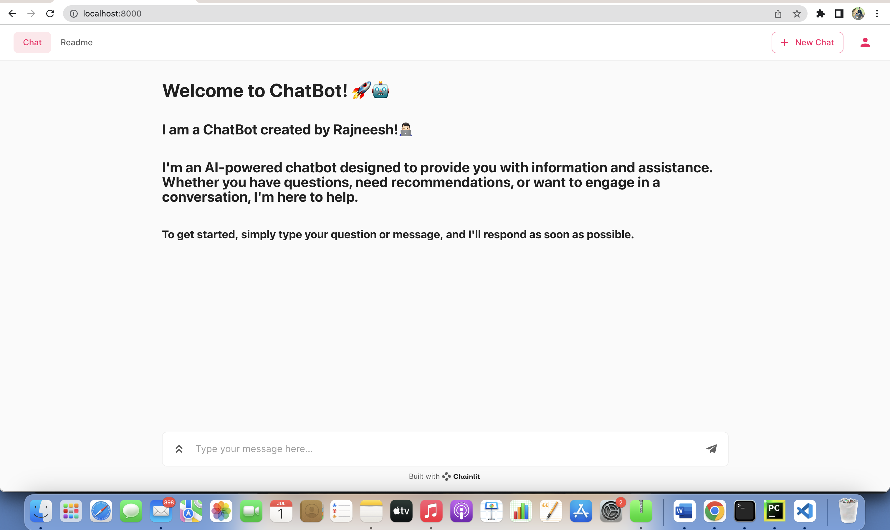
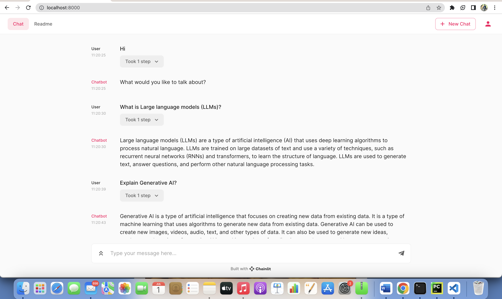

## Welcome to ChatBot! 🚀🤖

This documentation provides an overview of a chatbot implementation using the **OpenAI API key**, **Langchain, and Chainlit libraries**. It includes information about the code structure and usage.Langchain library, which enables seamless interaction with the OpenAI API. It also utilizes the Chainlit library for defining prompt templates and managing conversations.

## References:
* chainlit Documentation
* API Reference-OpenAI API Key


## Features

* Information Retrieval: The chatbot can answer questions and provide information on a wide range of topics.
* Recommendations: It can offer suggestions and recommendations based on user preferences and input.
* Conversational Engagement: The chatbot is capable of engaging in conversations, providing thoughtful responses to user messages.
* Assistance: It can assist users with various tasks and provide guidance as needed.

## Demo



### Limitations:

* Dependency on OpenAI API: The chatbot relies on the OpenAI API for generating responses.

* Knowledge Boundaries: My knowledge is based on the information available up until September 2021. I may not be aware of recent events, developments, or emerging trends beyond that point

### Feedback and Improvements:

Your feedback is valuable in helping us improve the ChatBot's performance and user experience. If you have any suggestions, encounter any issues, or want to report a bug, please let us know. Your input will be greatly appreciated!
Thank you for choosing ChatBot! Let's get started, and feel free to ask me anything!

### Code Usage
To use the chatbot implemented by this code, follow these steps:-

#### Step 1: Create a Python file
Create a new Python file named **app.py** in your project directory. This file will contain the main logic for your LLM application.

​**Install all necessary libraries**
```
pip install -r requirements.txt
```

#### Step 2: Write the Application Logic
In app.py, import the necessary packages and define a factory function decorated with langchain_factory that returns any LangChain instance. In this tutorial, we are going to use LLMChain to keep it simple. Here’s the basic structure of the script:

```
import os
from langchain import PromptTemplate, OpenAI, LLMChain
import chainlit as cl

os.environ["OPENAI_API_KEY"] = "YOUR_OPEN_AI_API_KEY"

template = """Question: {question}

Answer: Let's think step by step."""

@cl.langchain_factory(use_async=True)
def factory():
    prompt = PromptTemplate(template=template, input_variables=["question"])
    llm_chain = LLMChain(prompt=prompt, llm=OpenAI(temperature=0), verbose=True)

    return llm_chain
```
This function sets up an instance of LLMChain with a custom PromptTemplate. The LLMChain is responsible for generating responses based on the input provided by users.

Behind the scenes, Chainlit takes care of:

* Websocket connections
* Instantiating one LangChain instance per user session
* Pass the right callback handler to the LangChain instance
* Running the LangChain instance on user input
* Sending the output of the LangChain instance back to the user

#### Step 3: Run the Application
To start your LLM app, open a terminal and navigate to the directory containing **app.py**
Then run the following command:
```
chainlit run app.py -w
```

The **-w** flag tells Chainlit to enable auto-reloading, so you don’t need to restart the server every time you make changes to your application. Your chatbot UI should now be accessible at **http://localhost:8000**


​


